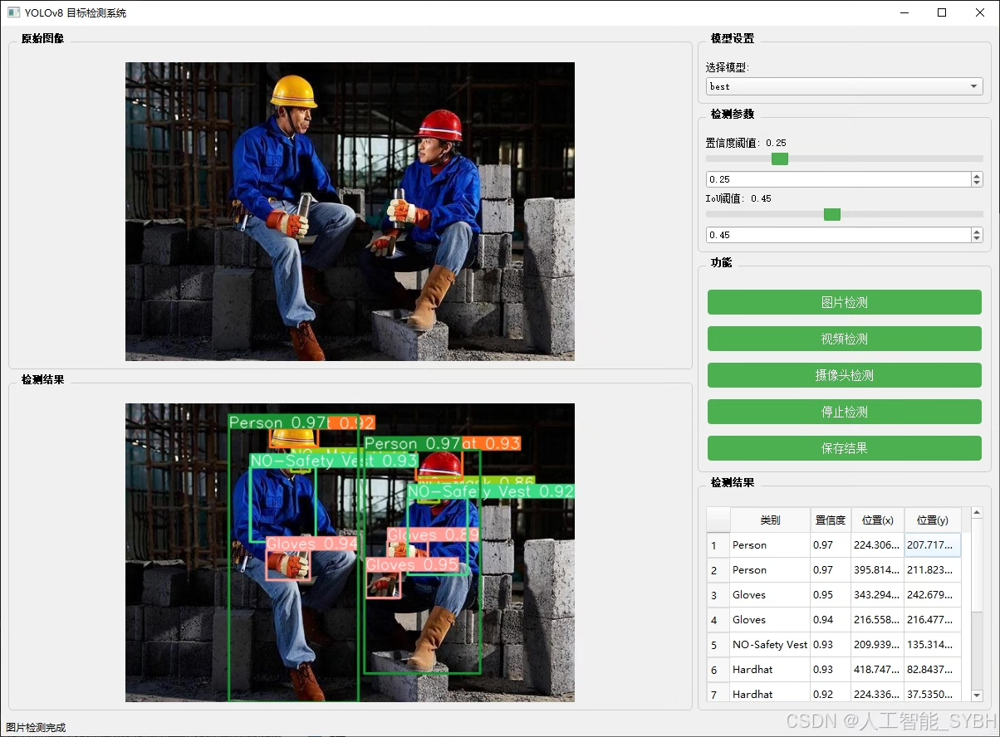
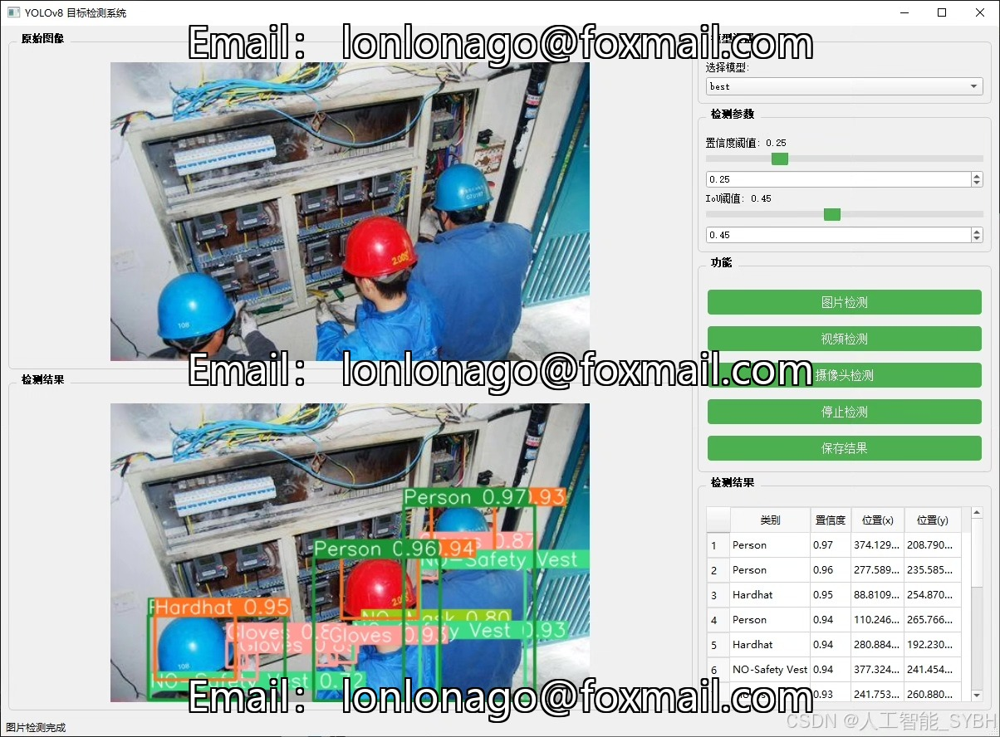
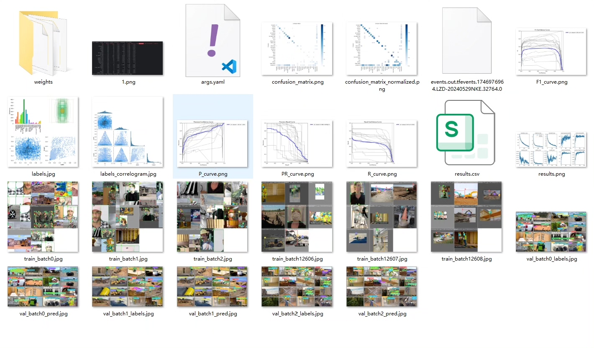
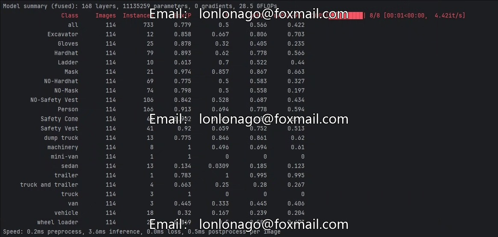
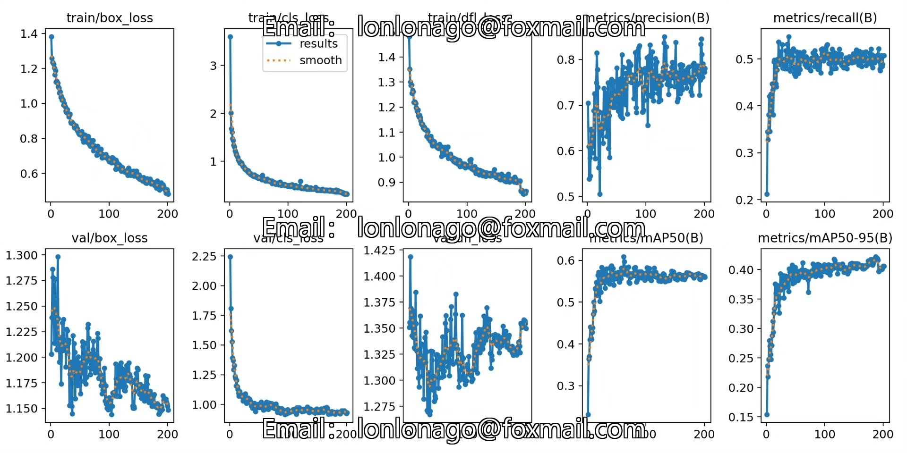
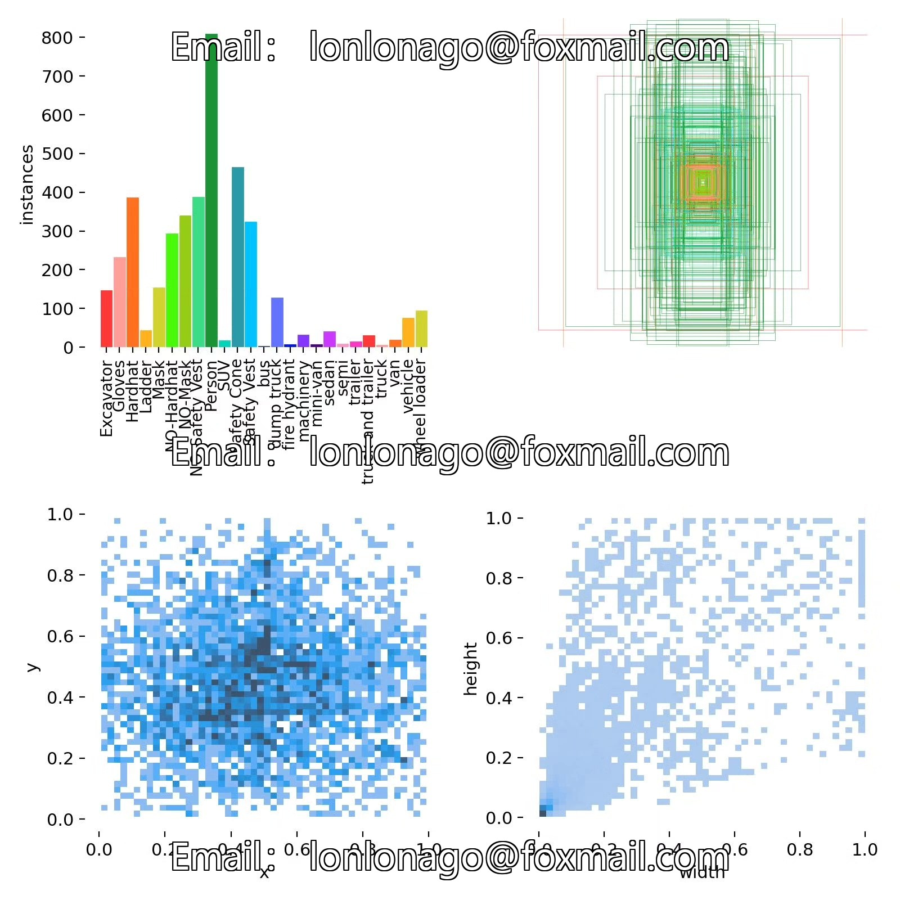
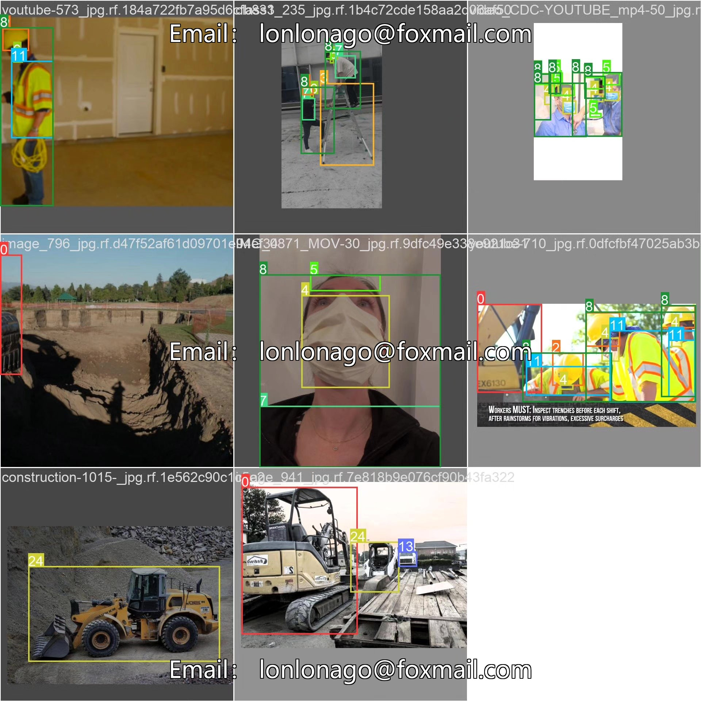
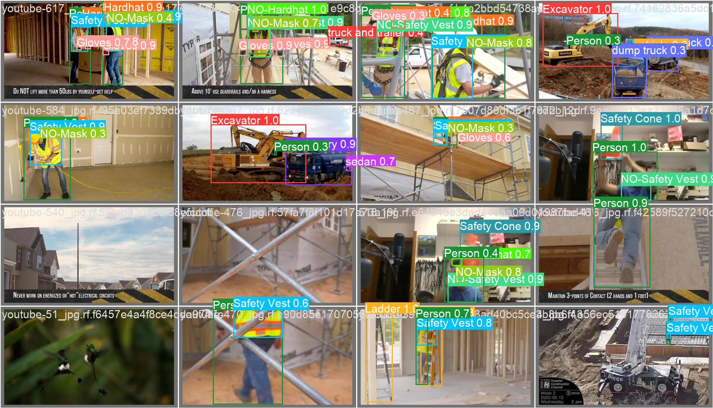

# Construction site safety detection system based on deep learning YOLOv8

## Body

This project has developed a construction site safety detection system based on the YOLOv8 deep learning algorithm. The purpose of this system is to automatically identify various safety elements in construction sites through computer vision technology. The system can detect 25 different targets (nc:25), including construction equipment (such as excavators, loaders), safety gear (such as safety helmets, reflective vests, gloves), personnel, vehicles, and violation behaviors (such as not wearing a safety helmet, not wearing a mask, not wearing a reflective vest, etc.). The project uses a dataset containing 717 images (training set 521, validation set 114, test set 82), and optimizes model performance through data augmentation and transfer learning techniques. This system can monitor construction sites in real-time, automatically identify safety hazards, significantly improve the efficiency of construction site safety management, reduce human supervision costs, and prevent accidents.

The company's products have been granted the official commercial license certification from YOLO.

We provide after-sales service.

After payment, we will provide WeChat ID for any questions.

Environment configuration: We will provide a tutorial on environment configuration, and WeChat will provide answers to questions.

Remote installation service: If you need remote configuration, an additional fee of 69 is required, with all fees refunded if the configuration fails (only refund installation fees for older computers).

Retraining dataset: After setting up the environment, you can train on your own computer. If you need us to retrain, just pay 69 plus computing power fees (2.5 yuan/hour).

Full after-sales service

## Images

## Payment

Here is a pay link on Stripe ( https://buy.stripe.com/3cs8yP7sY87d0vu9AB ). Please contact me lonlonago@foxmail.com after funding $89, and I will send you a complete data files , thank you!

